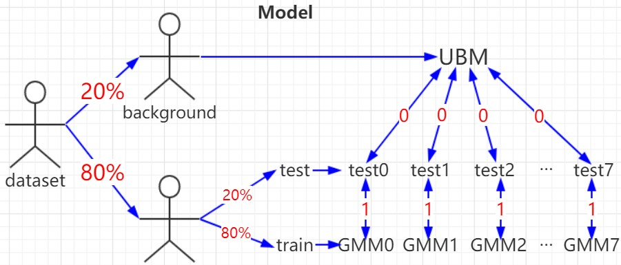

# GaitRecognization
## Introduction
Gait recognition and pedestrian classification experiment based on acceleration sensor using GMM-UBM.

This is the final project for the *Big Data and Artificial Intelligence Practical* Course in the spring semester of 2019 at Beihang University.

The dataset is from the School of Computer Science at Beihang University.

## Directory and file structure
The original dataset and the intermediate files generated during the initial preprocessing are stored in the ./data folder.

The ./pic folder contains pictures of different results obtained by adjusting the window size parameter CHUNK_LINE during the experiment.

The ./util folder stores the files used by the main function, where the constants used in all functions are defined in const.py, the feature extraction functions are in features.py, the data processing functions are in process.py, and the functions for result visualization are defined in visualize.py.

The main.py file in the root directory is the entry point of the program and proc.csv is the processed data file generated after the data has been processed and ready to be accepted by the algorithm.

## Model selection
I have used a speaker recognition algorithm based on GMM-UBM in speech recognition tasks. The waveform data of the sound appeared similar to this gait data, so the GMM-UBM algorithm was also selected for this experiment to implement classification recognition of the pedestrian. The results showed that applying the GMM-UBM model to gait recognition was feasible. 

GMM models the probability density of spatial distribution by fitting it with the weighted sum of multiple Gaussian probability density functions. It can smoothly approximate any shape of probability density function and is an easy-to-handle parameter model with strong representational ability for actual data. However, the larger the scale of GMM, the stronger the representational ability, and its negative effects will become more obvious: the scale of the parameters will also inflate proportionally and more data is needed to drive the parameter training of GMM to obtain a more general (or generalized) GMM model. 

GMM-UBM is actually an improvement on GMM. By fully training a GMM with selected background data, this GMM can be seen as a representation of pedestrian gait data. However, since it is trained from data mixed from more than one person, it does not have the ability to represent specific identities.

## Model structure
First, 20% of the dataset is separated for training the background model. The remaining 80% of the data is divided into training and testing sets in a ratio of 80%:20%.

The training set is used to train the gait-based pedestrian recognition model for each person.

The testing set is used to calculate the weighted log-probability as a score on the previously trained background model and the just trained gait-based pedestrian recognition model.

## Results
Applying the GMM-UBM algorithm, commonly used in speaker speech recognition, to gait-based pedestrian recognition classification is feasible and the model has a good performance.

On this dataset, the best results were obtained when the window size was 64: AUC=97.42%, EER=6.25%.

## Reference
- Tong K , Granat M H . A practical gait analysis system using gyroscopes[J]. Medical Engineering and Physics, 1999, 21(2):87-94.
- [Speaker recognition algorithm based on GMM-UBM](https://bat.sjtu.edu.cn/en/gmmubm/)
